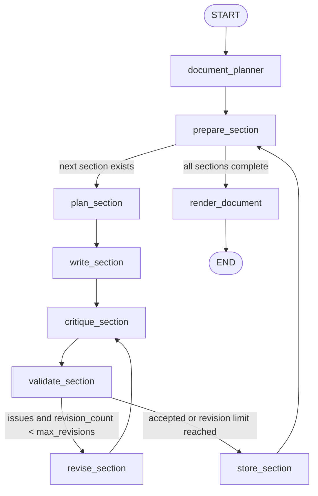

# LangGraph Workflow Map

This document reflects the workflow implemented in `src/synthetic_ner/tasks/orchestrator.py`.

## Graph

## Vertices

- `setup`: build runtime context, resolve case inputs, resolve schema, create `CASE_MEMORY.md`, start tracing
- `document_planner`: create document-level plan from canonical memory
- `prepare_section`: select the next section or finish
- `plan_section`: create a section-level plan from memory plus the document plan
- `write_section`: write one section in chunks
- `critique_section`: review the draft against memory and section plan
- `validate_section`: run deterministic checks for placeholders, short output, and invented references
- `revise_section`: rewrite the section using critic instructions
- `store_section`: persist approved section text and append a compressed summary into `CASE_MEMORY.md`
- `render_document`: assemble template, save text, schema, ground truth, and generation report

## Runtime State

- `doc_id`
- `memory_path`
- `memory_text`
- `document_plan`
- `section_order`
- `section_index`
- `current_section`
- `current_section_plan`
- `current_section_text`
- `current_section_issues`
- `current_revision_instruction`
- `revision_count`
- `section_outputs`
- `section_plans`
- `section_reviews`
- `final_text`

## Example Indictment Target

With the current config, the indictment prose target is `4620` words:

- `history`: `720`
- `charges`: `500`
- `facts`: `2200`
- `evidence`: `500`
- `assessment`: `700`

With the current workflow config:

- writer chunk size: `500`
- continuity tail: `900` characters
- section memory summary: `900` characters
- maximum revision rounds per section: `2`

## Artifacts

Each run writes:

- `output/<doc_id>/<doc_id>.txt`
- `output/<doc_id>/groundtruth.tsv`
- `output/<doc_id>/generation_report.md`
- `schemas/<doc_id>.json`
- `memory/case_<doc_id>/CASE_MEMORY.md`

## Langfuse Node Analytics

When Langfuse is enabled, each LangGraph node is emitted as its own child span
under the document trace.

Those node spans include compact state summaries plus metadata such as:

- `node_name`
- `current_section`
- `section_index`
- `revision_count`
- `issues_count`
- `next_node`
- `latency_ms`
